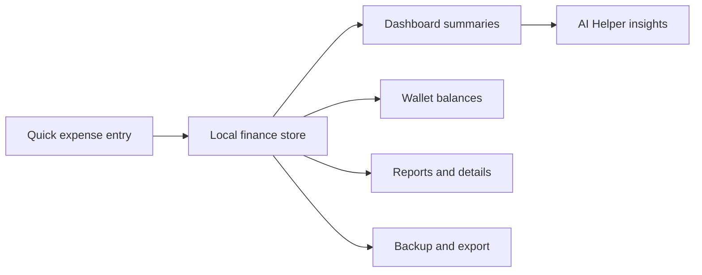

# Daily Hisab

<div align="center">


<p><strong>A polished Bengali-first personal finance workspace for daily expenses, wallets, budgets and better money habits.</strong></p>

<p>
  
  
  
  
</p>

</div>

## What is Daily Hisab?

Daily Hisab is a local-first expense tracker designed around the way people actually record money: quickly, in Bengali, from a phone. The dashboard keeps today’s spending, monthly totals and wallet balances visible without overwhelming the user.



## Highlights

### Fast daily logging

- Five configurable shortcuts in **আজকের খরচ**
- Add, remove and replace shortcuts while keeping the list capped at five
- Bengali categories, payment methods and descriptions
- Category-wise monthly totals with drill-down expense details

### Wallet-aware dashboard

- Personal and family wallet slides
- Add-money records, remaining balance and deductions
- Wallet controls through Hero Management
- Expense source switches for personal/family spending

### Useful reporting

- Total expense, total days and daily average cards
- Monthly category breakdown and expense trend
- Detailed category pages showing date, time, amount, payment method, description and notes
- Calendar, budgets, recurring expenses, reminders, notes and entries views

### Premium category system

The category icon picker is organized by real-life use instead of one long icon grid:

- Breakfast: tea/coffee, egg, sandwich, biscuit and milk
- Lunch & dinner: biryani/rice, curry, chicken, beef, fish, salad and fast food
- Drinks & desserts: Pepsi/soft drink, water/juice, ice cream, cake and sweets
- Transport, shopping, bills, home, health, education and more

### AI Helper

- Floating assistant available from the app shell
- Concise Bengali-friendly budgeting guidance
- Server-side WalkAI proxy at `/api/ai-helper`
- Provider errors are surfaced clearly without exposing API keys in the browser

## Tech stack

| Layer | Technology |
| --- | --- |
| App | Next.js 16 App Router, React, TypeScript |
| Styling | Tailwind CSS, local shadcn/ui-style components |
| Icons | Lucide React |
| Charts | Recharts |
| Authentication | Firebase Auth and Google sign-in |
| Profile media | Firebase Storage |
| Data | LocalStorage-first finance store, Supabase schema ready |
| AI | WalkAI OpenAI-compatible chat endpoint |

## Project structure

```text
app/                         App Router pages and API routes
components/dashboard/       Responsive dashboard and mobile flows
components/pages/            Feature page implementations
components/state/            Finance, wallet, auth and theme state
lib/                         Finance calculations, exports and integrations
supabase/                    Database schema for future sync
types/                       Shared TypeScript domain types
```

## Getting started

### Requirements

- Node.js 20+
- npm
- Firebase project (only required for authentication/profile uploads)
- Supabase project (optional; schema is included for future sync)

### Install and run

```bash
npm install
npm run dev
```

Open [http://localhost:3000](http://localhost:3000).

### Verify a production build

```bash
npm run lint
npm run build
npm run start
```

## Environment variables

Create `.env.local` locally. Never commit this file or put server secrets in `NEXT_PUBLIC_` variables.

### Firebase

```env
NEXT_PUBLIC_FIREBASE_API_KEY=
NEXT_PUBLIC_FIREBASE_AUTH_DOMAIN=
NEXT_PUBLIC_FIREBASE_PROJECT_ID=
NEXT_PUBLIC_FIREBASE_STORAGE_BUCKET=
NEXT_PUBLIC_FIREBASE_MESSAGING_SENDER_ID=
NEXT_PUBLIC_FIREBASE_APP_ID=
NEXT_PUBLIC_FIREBASE_MEASUREMENT_ID=
```

Enable Email/Password and Google providers in Firebase Authentication. Enable Firebase Storage for profile image uploads.

### Supabase

```env
NEXT_PUBLIC_SUPABASE_URL=
NEXT_PUBLIC_SUPABASE_PUBLISHABLE_KEY=
```

Run [`supabase/schema.sql`](supabase/schema.sql) in the Supabase SQL editor. The current finance experience remains local-first, so the app still works without Supabase sync.

### WalkAI (server-side only)

```env
AI_PROVIDER=walkai
WALKAI_BASE_URL=https://walkai.top/v1
WALKAI_API_KEY=your-chat-api-key
WALKAI_MODEL=deepseek-chat
WALKAI_FALLBACK_BASE_URL=https://walkcoding.top/v1
```

Use a **text/chat** group in WalkAI. Do not use image-only groups such as `生图` for the chat helper. Keep these variables in Vercel Project Settings → Environment Variables; never expose them through the frontend.

`WALKAI_BASE_URL` should contain only the base URL. The server appends `/models` and `/chat/completions` automatically.

## Deployment

The project is ready for Vercel:

1. Import the repository into Vercel.
2. Add the Firebase and WalkAI environment variables.
3. Deploy the `main` branch.
4. Verify `/`, `/categories`, `/expense-details/<category>` and `/ai-helper` on mobile.

## Data and privacy

Finance records are stored locally by user scope in the browser. Backups are generated locally. API keys are used only by the server route and should never be committed or sent from client-side code.

## Screenshots

The UI is intentionally responsive: the mobile dashboard uses a wallet hero slider, bottom navigation, quick expense cards and touch-friendly sheets; desktop expands the same data into a dashboard, charts and tables. For product screenshots, capture the deployed app at a 390×844 mobile viewport and a desktop viewport after adding representative demo data.

## Contributing

Keep changes focused and verify them before opening a pull request:

```bash
npm run lint
npm run build
```

Use clear commit messages and avoid committing `.env.local`, generated `.next` files or private user data.

---

<div align="center">
  <sub>Built with care for simpler daily money decisions.</sub>
</div>
